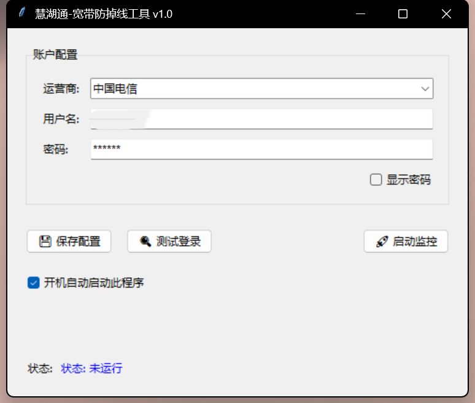

# HuiHuTong_AutoLogin
住在人才公寓一定会对慧湖通宽带网络的登录系统感到十分厌烦，而该项目能够帮你解决这一痛点。该项目利用python构建了一个能够自动识别当前主机网络状态的程序，若发现网络断开，将自动模拟输入在慧湖通宽带网站登录。

# 慧湖通自动登录工具 (HuiHuTong AutoLogin)
一个使用 Python 和 PyQt5 开发的桌面应用程序，旨在实现对“互通通”系统的后台自动登录功能。

## 功能特性

*   **自动登录**：自动填写账号、密码，并模拟点击登录按钮。
*   **后台运行**：支持最小化到系统托盘，持续运行。
*   **定时任务**：支持设置登录间隔时间，定期尝试登录。
*   **日志记录**：记录登录过程和结果，方便排查问题。
*   **安全性**：该程序为完全本地程序，能够保护你个人的账户信息安全

## 环境要求
*   直接下载release版本不需要环境要求
*   Python 3.x
*   PyQt5
*   requests (或其他用于网络请求的库)

## 使用方法
*   **账号密码**：程序启动后，可以在图形界面中输入您的宽带账号和密码。
*   **选择运营商**：选择您宽带的运营商（当前仅支持电信和移动）
*   **登录间隔**：在界面中设置登录重试的时间间隔。*不建议修改*
*   **配置信息**：个人的账户配置信息会以config文件自动保存在本地
*   **注意事项**：程序做了后台运行功能，直接点击×号并不能完全关闭程序，如需关闭程序要到任务管理器中将其杀掉

## 程序截图

以下是应用运行时的界面截图。

## 文件说明

*   `auto_login_app.py`: 程序的主要源代码。
*   `icon.ico`: 程序图标文件。
*   `requirements.txt`: 项目依赖的 Python 库列表。
*   `README.md`: 项目说明文档。

## 许可证

本项目使用 [在此处填入您的许可证名称，例如：MIT License] 许可证。详见 `LICENSE` 文件。
